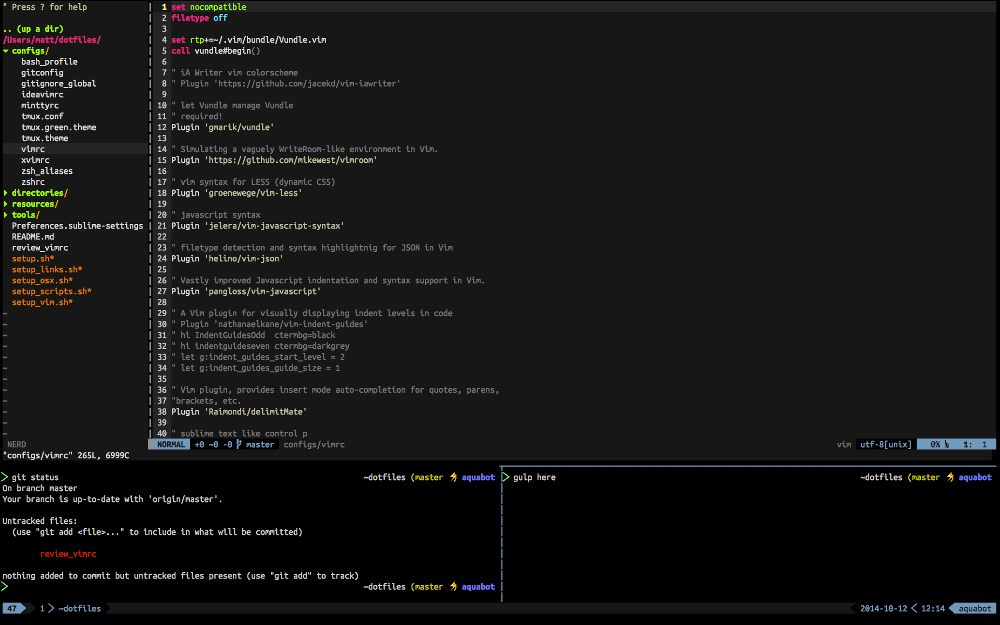

## dotfiles

> __NOTE:__ Be sure to update the `.gitconfig` so it uses the proper email address.

### Mac Users

* Make sure to have the Xcode command line tools installed before running on OSX

### Install with curl 

`curl -L https://raw.github.com/icecreammatt/dotfiles/master/tools/install.sh | sh`

### Post Install

1. Update `.gitconfig` to include the proper name and email address
1. Update the remote origin so the auto updater fetches from the fork

   ```
   git remote remove origin
   git remote add origin git@github.com:USERNAME/dotfiles
   ```
   
   > The bottom of the `.zshrc` has a check that it will run to auto pull and rebase the dotfiles similar to how the `oh-my-zsh` updater works. Any items which are not checked in are stashed and applied after the pull. For long term items which are not intended to be checked in use the `.zshrc_local` This file is ignored.
   
1. Review aliases in `.zsh_aliases`

## Preview
> Run [`devmux`](https://github.com/icecreammatt/scripts/blob/master/devmux.sh) to get this layout.


